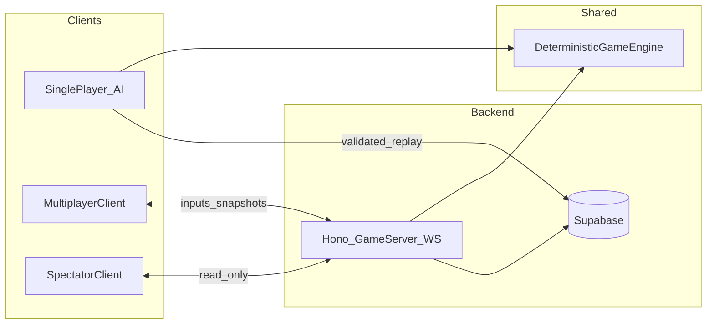

# Mamba — Full Implementation Plan

TypeScript + HTML5 Canvas remake of Bert Uffen’s 1989 Mamba. One deterministic engine powers single-player, AI, multiplayer, spectating, and anti-cheat.

## Locked decisions

| Topic | Choice |
|-------|--------|
| Client | TypeScript + Canvas, Vite, no heavy game libs |
| DB / Auth | Supabase (Postgres + Auth + RLS) |
| Identity | Guest by default; account to sync global scores + spectate |
| Multiplayer | Shared competitive board |
| Net authority | Server-authoritative Hono WebSocket game server |
| Field sizes | Small `11×20`, Medium `22×40`, Large `33×60` (height × width) |
| Score caps | Blue `min(level, 10)`; green `min(level × 10, 100)` |
| Speed | Constant tick rate (no per-level acceleration) |
| Menus | HTML/CSS beside the canvas when space allows |
| Scaling | Live rescale cell size so the board fits the viewport |
| Sound | Web Audio beeps (see Phase 2) |

## Architecture

**Monorepo**

- `packages/engine` — pure TS rules (no DOM)
- `apps/web` — Vite + Canvas + HTML menus
- `apps/server` — Hono + WebSocket ticks (Phase 6+)
- `supabase/` — migrations, RLS, Edge Functions (Phase 4+)

---

## Phase 1 — Core single-player (done)

- Deterministic engine: seed + inputs → identical state/score
- Medium field, length 5, molt, yellow TTL, green wall chains
- Blue eat → 1 spawn; green/yellow eat → 2 spawns
- Canvas renderer, input buffer (2 turns), constant 10 TPS
- Snake: bright head + dark face, solid body, transparent chevron tail
- DPR-aware text (no pixelated CSS stretch)

## Phase 2 — Sizes, menus, sound (in progress)

- Size select S/M/L; remember last size in `localStorage`; always changeable
- HTML/CSS menu panel beside canvas (stacks on narrow viewports)
- Live cell-size rescale from available viewport
- Constant speed (keep current TPS)
- Web Audio:
  - Blue: A (880 Hz) → B (~988 Hz)
  - Green: G# → B at 2× blue’s B (~1661 → ~1976 Hz)
  - Yellow: A (440 Hz) → F4 (~349 Hz, downward)
  - Plus short molt / death cues; settings mute toggle

## Phase 3 — Local leaderboards (done)

- Scores stored once with timestamp; boards filtered by size × period × mode
- Periods: all-time / weekly (Mon local) / daily (local midnight); top 10
- Mode `solo` now (schema ready for `ai:*` / `mp`)
- Name prompt on qualifying game over; name remembered in settings

## Phase 4 — Supabase + global boards + anti-cheat (done)

- Auth: email + password (magic link optional); guest keeps local-only scores
- Submit `{seed, size, mode, headings}` → Edge Function `verify-score` re-simulates → verified insert
- UI: Local / Global toggle; filters for size × period × mode
- See [phase-4-supabase.md](phase-4-supabase.md) for setup

## Phase 5 — AI opponent

- Shared board; difficulties emit same direction inputs
- Leaderboard `mode = ai:{difficulty}` (human score)

## Phase 6 — Online 1v1

- Hono WS server owns ticks; clients send inputs only
- Matchmaking / room codes; head-on → both die

## Phase 7 — Spectating

- Auth-gated read-only WS clients; late join via full snapshot

## Phase 8 — Divisions / tournaments (stretch)

- Seasons / MMR; brackets reuse Phase 6–7

---

## Game rules (engine source of truth)

| Rule | Detail |
|------|--------|
| Start | Length 5 |
| Blue | Init 5–12; eat → +1 length, `min(level,10)` pts, 1 spawn |
| Molt | After 12–22 blue/green this life → shed to walls, keep 5, level++ |
| Yellow | On molt; `⌊√level × rand(20–50)⌋`; TTL = Manhattan × rand(2–5); eat → 2 spawns |
| Green | Spawn on wall; `min(level×10,100)`; 10% directional chain; eat → 2 spawns |
| Death | Border, self, or red wall |

## Implementation order

Phase 1 → 2 → 3 → 4; AI (5) can parallel after 1/4; MP (6) after engine + auth; spectate (7) → tournaments (8).
