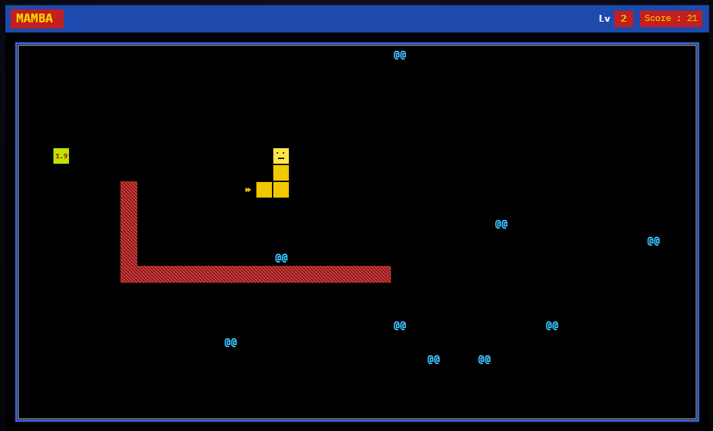
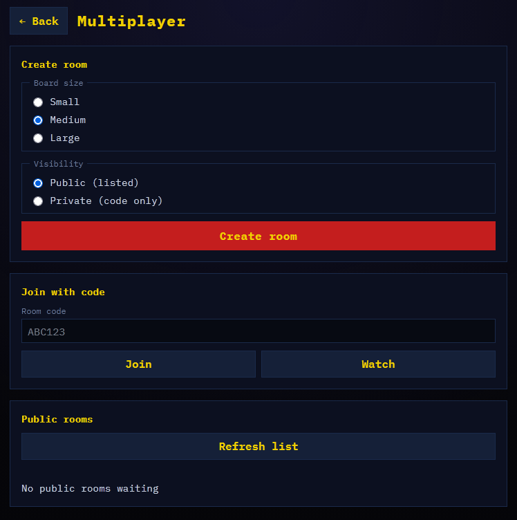

# MAMBA

A TypeScript + HTML5 Canvas remake of **Mamba**, the 1989 MS-DOS snake game by Bert Uffen (Amsterdam).

Unlike classic Snake, your mamba **molts**: after eating enough pellets it sheds most of its body into a permanent red wall, keeps the newest five segments, and a timed yellow bonus pellet appears. Pellets that would spawn on a wall become valuable green pellets instead.





## Current (Phase 7)

### Core

- Deterministic headless engine with **replay verification** (solo + AI + online)
- Field sizes S/M/L, HTML menu, live rescale, sound (S), pause (P; disabled in online)
- **Help** page (menu): remake story plus controls, scoring, and modes
- Preferences in `localStorage`; guest play always works offline (online requires account)
- **Solo**, **vs AI** (easy / medium / hard), or **online 1v1** (room codes; public/private)

### Multiplayer

- Online: server-authoritative WS; time + win bonuses like vs AI, but **deterministic** pellet/molt scoring (fixed molt at 20, fixed yellow value, no opponent-pellet subtraction — vs AI keeps the RNG); highest score wins; head-on → no win bonus; Ready toggles + countdown before start; **Elo** (start 1000, K=32) updated after each match
- **Spectating**: signed-in users can watch any public room (Watch button, or by code); board updates live, read-only. Spectators can toggle "join if a seat opens" — if a player leaves once a match has started readying up, the first queued spectator takes their seat and the match restarts fresh
- **Standings sidebar**: live games-won tally per player plus a breakdown of the last finished game; tracked server-side per room (reset when the seat pairing changes, kept across a same-pair rematch) so it's correct even for a spectator who joins mid-session. Swaps in for the Scores leaderboard whenever you're in a multiplayer room

### Accounts & scores

- **Local + global leaderboards** filtered by board size, play mode (menu), scope, and period (`mp` for multiplayer nets)
- Signed-in **Profile** page: Elo rating; change username/password; play counts per size/mode; click a row for score-over-time chart (dots + 10-game rolling average; X axis by date or evenly by game)

See [`.claude/plans/mamba-full-implementation-plan.md`](.claude/plans/mamba-full-implementation-plan.md), [`.claude/plans/phase-6-multiplayer.md`](.claude/plans/phase-6-multiplayer.md), and [`.claude/plans/phase-7-spectating.md`](.claude/plans/phase-7-spectating.md).

## Rules (Phase 1)

| Rule | Detail |
|------|--------|
| Field | Small 11×20 / Medium 22×40 / Large 33×60 (height × width) |
| Start | Snake length 5 |
| Move | One cell per tick; head advances, tail removed unless you just ate |
| Blue pellets | Initial count `5–12`; eat → length +1, score `min(level, 10)`, spawn **one** replacement |
| Green pellet | When a spawn lands on a wall; worth `min(level × 10, 100)`; 10% chance adjacent walls in one direction also turn green; eat → spawn **two** pellets |
| Survival (vs AI / online) | Every second while alive, score `+level` (HUD: Time); each snake uses its own level |
| Win bonus (vs AI / online) | Sole survivor gets `+100 + (winner's level − loser's level)`; head-on (both die) → no win bonus |
| Yellow pellet spawn (vs AI / online) | Spawns on molt (lime); ~5–10 Dijkstra ticks closer to the snake that molted; after 5 ticks TTL = Dijkstra + 5 (farther head), or `max(2 × Manhattan, 60s)` if unreachable; countdown in seconds (1 decimal under 10s; red under 3s); eat → spawn **two** pellets |
| Death | Hit border, self, red wall, or (vs AI / online) the other snake |
| Winner (vs AI / online) | Highest total score |

Score caps follow the Wikipedia description of the original: blue max **10**, green max **100**.

Solo has no opponent, so it skips survival/win bonuses and just banks the raw pellet score. **vs AI** and **online** share the shape of the rules above, but roll the dice differently:

| Rule | vs AI | Online (real multiplayer) |
|------|-------|----------------------------|
| Molt threshold | Random `12–22` pellets this life | Always exactly `20` |
| Yellow pellet value | `⌊√level × random(20–50)⌋` | `⌊√level × 20⌋` (fixed) |
| Saved net score | Your pellets − opponent pellets + your time + your win | Your pellets + your time + your win — opponent's pellets are **never** subtracted |

In short: vs AI keeps the randomness (and the score-shaving), online strips both out so a win is just a win.

## Setup

```bash
npm install
npm test
npm run dev          # web
npm run dev:server   # multiplayer WS (optional)
```

Open the URL Vite prints (default `http://localhost:5173`). For online play, set `VITE_WS_URL=ws://localhost:8787` in `apps/web/.env.local` and run the server.

**Controls:** arrow keys to steer · Enter / Space to start or restart · S to toggle sound · P to pause.

Pick **Solo** or **vs AI** (and a difficulty) in the menu before Play.

## Docker (static web)

Serves the Vite build with nginx under **`/mamba/`**, plus the **multiplayer** WS service (`mamba-ws`). Auth, Postgres, and `verify-score` stay on **cloud Supabase**.

Step-by-step VPS + Supabase + local dev (every command names where / which file): [`.claude/plans/deploy-vps-and-local.md`](.claude/plans/deploy-vps-and-local.md).

The containers join the shared Docker network `host-edge` (`mamba`, `mamba-ws`) so the host Caddy proxy can reach them. Public URL: [https://lewistrick.com/mamba/](https://lewistrick.com/mamba/).

```bash
cp .env.docker.example .env
# Fill SUPABASE_URL, SUPABASE_ANON_KEY, SUPABASE_SERVICE_ROLE_KEY, VITE_WS_URL
# (Compose maps SUPABASE_* into the web image as VITE_* at build time)

# Ensure host-edge exists (started by /home/weekmenu/apps/proxy).
docker compose up -d --build
```

Caddy should proxy HTTP `/mamba*` → `mamba:80` and WebSocket `/mamba/ws` → `mamba-ws:8787`. Reload after changing the Caddyfile:

```bash
cd /home/weekmenu/apps/proxy
docker compose exec caddy caddy reload --config /etc/caddy/Caddyfile
```

Localhost-only debug: [http://127.0.0.1:34364/mamba/](http://127.0.0.1:34364/mamba/) (path prefix required).

For Auth redirects, add these to Supabase **Authentication → URL Configuration** (Site URL / Redirect URLs):

- Production: `https://lewistrick.com/mamba/`
- Local Vite: `http://localhost:5173`
- Local container: `http://127.0.0.1:34364/mamba/`

Rebuild after changing `.env` Supabase values (`docker compose up --build`) — editing `.env` alone does not update an already-built image. `npm run dev` uses base `/`; Docker builds with `VITE_BASE_PATH=/mamba/`.

## Supabase (global scores)

Optional. Without config, everything works offline.

1. Create a project at [supabase.com](https://supabase.com)
2. Apply the database schema: open **SQL Editor**, paste [`supabase/setup.sql`](supabase/setup.sql), run it once
3. From the repo root: `npm run sync:engine`, then `npx supabase login`, `npx supabase link --project-ref <your-ref>`, and `npx supabase functions deploy verify-score`
4. Copy [`apps/web/.env.example`](apps/web/.env.example) to `apps/web/.env.local` and set `VITE_SUPABASE_URL` + `VITE_SUPABASE_ANON_KEY`
5. Add Auth redirect URLs: `http://localhost:5173` (dev) and `https://lewistrick.com/mamba/` (production)
6. Under **Authentication → Providers → Email**, keep Email enabled and **disable Confirm email** (free built-in mailer is limited to ~2 emails/hour; password signup then works immediately)

Auth is **email + password** (magic link is optional). After sign-in, choose a **username once** before Play; that name is locked for global scores. Raw `{score}` posts are rejected — the server re-simulates your replay via `verify-score`.

**Optional later:** custom SMTP via Proton — see [`.claude/plans/phase-proton-smtp.md`](.claude/plans/phase-proton-smtp.md) (needs a custom domain address, not just a paid `@proton.me` account). Then re-enable Confirm email under **Authentication → Providers → Email** if you want verified addresses.

## Monorepo layout

```
apps/web/           Vite + Canvas client
apps/server/        Hono WebSocket multiplayer server
packages/engine/    Pure TypeScript game rules (no DOM)
deploy/             nginx config for the Docker image (/mamba/)
Dockerfile          Multi-stage Node build → nginx
docker-compose.yml  web + server on host-edge (mamba, mamba-ws)
```

The engine is seeded and deterministic: the same seed and input sequence always produce the same score and state (needed later for anti-cheat and multiplayer).

## Scripts

| Command | Description |
|---------|-------------|
| `npm run dev` | Start the web client |
| `npm run dev:server` | Start the multiplayer WebSocket server |
| `npm test` | Run engine + web + server unit tests |
| `npm run build` | Typecheck engine + build the web client |
| `docker compose up -d --build` | Build and serve web + MP server on host-edge |

## Credits

Original game © 1989 Bert Uffen, Amsterdam.
